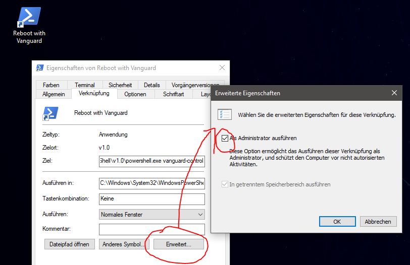

# Vanguard Control Script

Disables Vanguard by default. If it is enabled at startup, gives you 120 seconds (configurable)
top stop it from deactivating vanguard. You can then enable Vanguard for a single boot (see below).

## Requirements

* Windows 10
* Powershell

## Installation

* Create a scheduled task (you can import [this XML file](VanguardControlAtStartup.xml), adapt settings and paths to your setup)
  * Trigger: run at user logon
  * Permissions: System/Admin
  * Actions: run `powershell C:\Path\To\vanguard-control.ps1 -Mode AfterStartup`
* Create a desktop shortcut to powershell and check "Run as Administrator". Edit the shortcut so that it has this command:
  `powershell C:\Path\To\vanguard-control.ps1`
  
* Open PowerShell as administrator (search powershell, select it with the keyboard and hit Ctrl+Shift+Enter)
  * run `set-executionpolicy remotesigned`
  * answer `A`

## Usage

If you want to play Valorant:
* save all open files!
* double-click your desktop icon
* your PC will reboot in 10 seconds.
* After the reboot, vanguard will be enabled.
* For the boots after that it'll be disabled again.

## Parameters

|Name              |Default             |Description                           |
|------------------|--------------------|--------------------------------------|
|Mode              |`RebootWithVanguard`|`RebootWithVanguard` or `AfterStartup`|
|AllowFile         |`ALLOW VANGUARD`    |Name of the file, relative to the script, whichs presence allows vanguard to keep running.|
|StopDelay         |120                 |In AfterStartup mode: number of seconds after logon to wait until stopping/killing vanguard.|
|VgTrayStartTimeout|45                  |In Afterstartup mode: number of seconds after logon to wait for vgtray.exe to start, so it can be stopped. Increase this if your PC is slow and vgtray.exe keeps running.|
